### Авторизация

Доступ в интерфейс Datalens предоставляется только авторизованным пользователям:

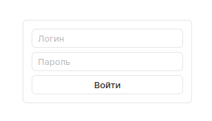

Текущий авторизованный пользователь отображается в левом меню.

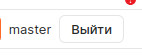

[Сруктура БД и описание функций](lessons/auth/backend.md)

### Авторизация через OIDC

Доступна возможность авторизации через `OIDC` провайдер, можно подключить до `4`. Все авторизованные таким образом пользователи по умолчанию имеют права только для чтения (роль `datalens` в таблице `core.pd_roles`).

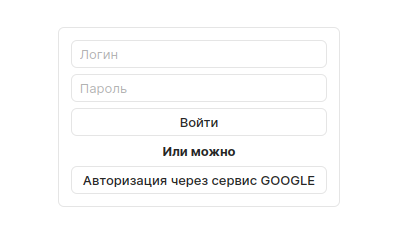

[Подробнее](lessons/auth//index.md)

### Права доступа

В интерфейс встроена примитивная "ролевая" модель, где есть:

* Мастер пользователь - неограниченный доступ.
* Администратор - доступ только в рамках текущего проекта. Решение предусматривает, что могут быть несколько проектов, которые "крутятся" в одной инсталяции Datalens, и у каждого проекта свой администратор и пользователи.
* Пользователь - доступна возможность только просмотра.
* Внешний пользователь - пользователи авторизовавшиеся через OIDC-провайдер.

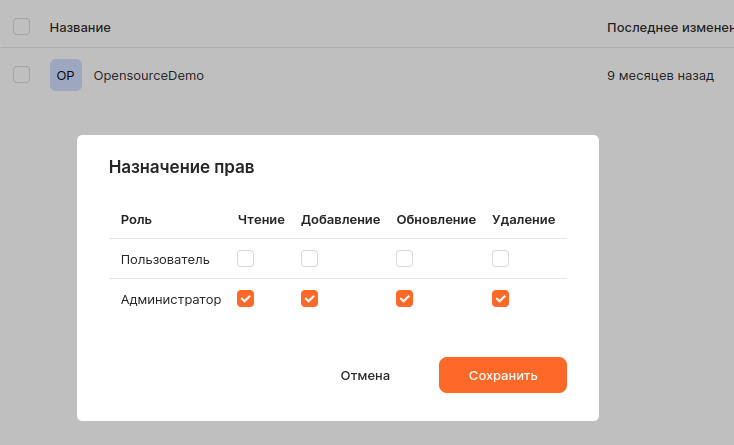

По умолчанию все объекты запрещены, чтобы было отображение, требуется выдавать права на это.

#### Связанные объекты

В разделе "Связанные объекты" добавлен функционал обеспечивающий "перенос" текущих прав объекта на связанные. Такой механизм позволяет быстро применить права доступа на связанные объекты. Например, если доступ предоставлен к dashboard, то благодаря этому механизму можно быстро перенести права на чатры, просто передвинув "переключатель".

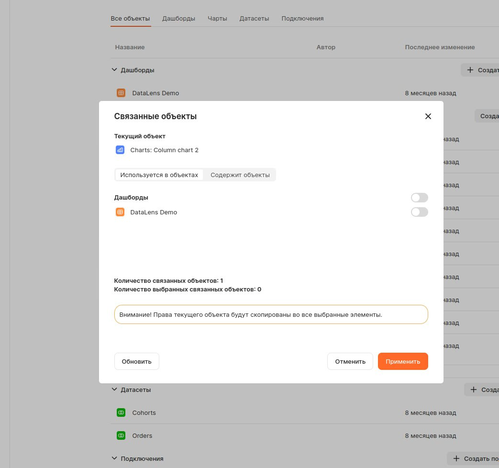

__Примечание__: данный механизм не позволяет "отбирать" права. Назначение прав через этот функционал - это лишь копирование прав родительского объекта на связанные. При этом предыдущие права "перетираются".

[Подробнее](lessons/reference_object/index.md)

### Администрирование

Для пользователя с ролью `master` доступен интерфейс администрирования:

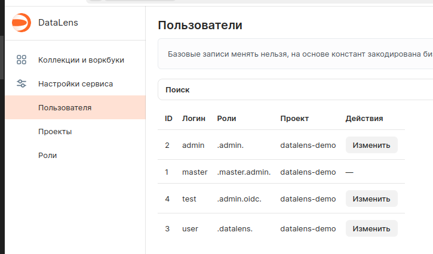

#### Роли

Интерфейс добавления пользовательских ролей.

__Примечание__: при назначении прав пользователям, требуется выполнить одно обязательное условие, у пользователя должна быть одна из базовых ролей: `admin` (Администратор) или `datalens` (Пользователь).

#### Проекты

Проекты позволяют разделять объекты datalens (области видимости) для пользователей. Этот механизм будет полезен если у Вас несколько администраторов, которые могут быть изолированы друг от друга.

__Примечание__: пользователь с ролью master видит все объекты и независимо от проектов. Проекты указываются на уровне `пользователей`.

#### Пользователи

Администрирование пользователей: создание, редактирование. 

__Примечание__: удаление пользователей невозможно, есть только механизм из отключения (сделать неактивными). Ограничение связано с внутренней реализацие сервиса безопасности `datalens-auth`.

* в данном интерфейсе есть возможность назначения ролей (на одного пользователя их можно назначить несколько, главно, чтобы одна из ролей была базовой: admin или datalens);
* можно изменить привязку на уровне проекта - область видимости;
* обновить или задать пароль.

Интерфейс поддерживает функционал поиска по атрибуту `логин`.

##### Внешние пользователи

Если пользователь выполнил авторизацию с внешего сервера, то ему автоматически назначется роль oidc. У данной роли есть одно огарничение - функционл по смене пароля для них не доступен.

### Поделиться

Доступна возможность передать чарт или дашборд, как ссылку:

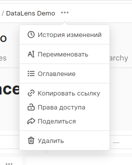

__Примечание__: ссылка будет доступно до тех пор пока учётные данные пользователя, которые передал ссылку не меняются.

__Безопасность__

В интерфейсе "Поделиться объектом" генерируется уникальная ссылка, которая хранит "автора", который передаёт ссылку и отчёго имени будет разрешён просмотр:

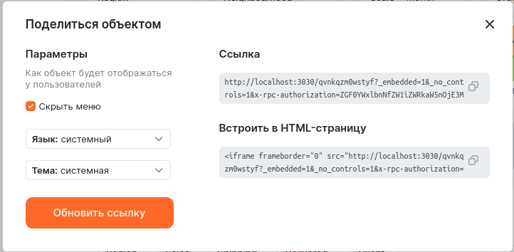

`Внимание`: Пользователь, который получит ссылку будет иметь доступ только для просмотра этого объекта и больше никуда. Редактирование будет запрещено.

Если нужно отменить выданную ссылку, то нужно нажать кнопку "Обновить ссылку". Один объект - одна ссылка.

### Использование встроенных параметров для QL-чартов

По умолчанию в интерфейс QL-чарта передаются:

* __user_id: integer - идентификатор текущего авторизованного пользователя;
* __embed: integer - признак перехода из расшаренной ссылки, `-1` - Нет, `1` - Да.

Чтобы эти параметры были доступны в SQL запросах и требуется инициализировать их в параметрах интерфейса:

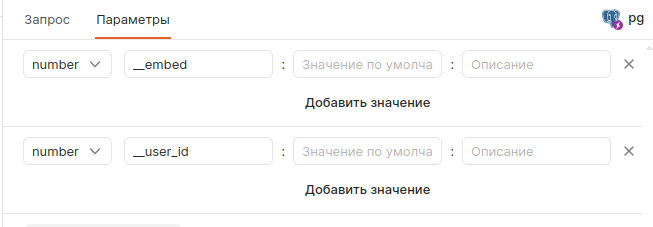

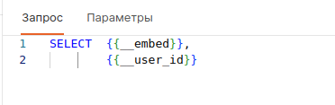

Благодаря этим системным параметрам можно внутри запроса QL-чарта фильтровать данные по текущему авторизованному пользователю.

__Описание__

Это специальное поле для параметров, которые было заведено для сохранение дополнительных значений, которые можно передать в третьи системы (особенность версии, которая делалась под заказчика).

### Скачивание дашбордов

В интерфейсе дашбордов добавлена возможность скачать данные в Excel. Файл формируется для табличных данных. Изображения (графики) - в Excel не сохраняются.

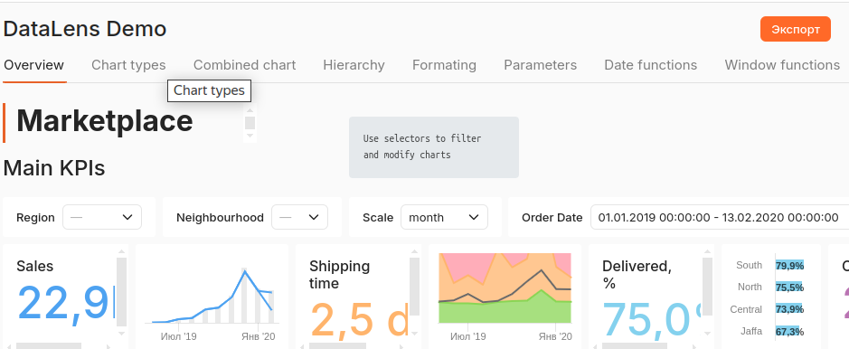

### Сохранение графиков в PDF

Для графиков, которые основаны на D3 (HC="0") добавлена функция для сохранения изображения в PDF.

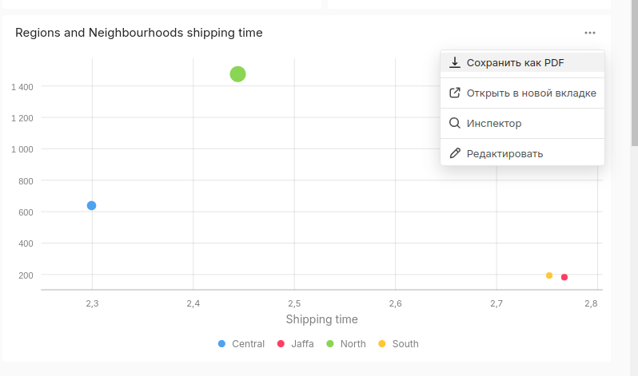