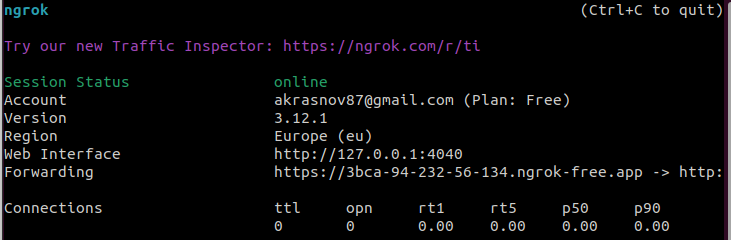
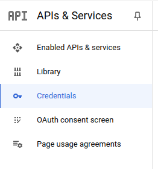
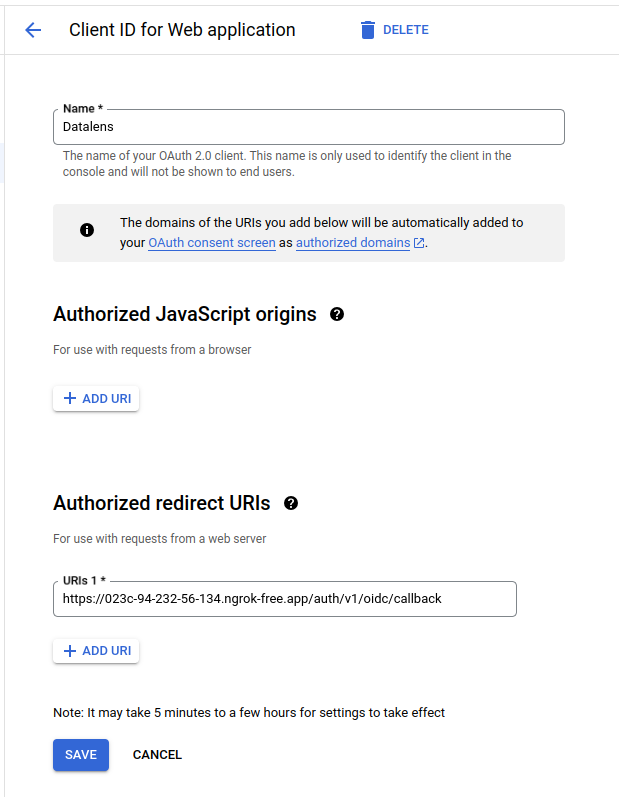

## ngrok

[ngrok](https://ngrok.com/) — это сервис, который позволяет открыть доступ к внутренним ресурсам машины, на которой он запущен, из внешней сети, путем создания публичного адреса, все запросы на который будут переброшены на локальный адрес и заданный порт.

Данный сервис будет полезен для тестирования авторизации через внешнии системы. Ниже будет описан процесс интеграции Google-авторизации

1. Запускаем `datalens`, сейчас нам нужно чтобы был доступен хост `localhost:8080`:

<pre>
git clone https://github.com/akrasnov87/datalens && cd datalens
docker compose -f docker-compose-demo.yml --env-file ./.env.demo up -d
</pre>

2. Устанавливаем и настраиваем ngrok

<pre>
sudo snap install ngrok
</pre>

Переходим на сайт [ngrok](https://ngrok.com/) и авторизуемся (или регистриуемся).

После авторизации Вам нужно привязать Ваш установленный ngrok к этой учётной записи. Для этого переходим на вкладку Getting Started -> Setup & Installation. В ней находим следующую строку:

<pre>
ngrok config add-authtoken [Ваш токен]
</pre>

Выполняем её на своёй машине, где запущен `datalens`. Авторизация должна быть выполнена, для проверки вводим команду `ngrok http 8080`.

Если после выполнения команды Вы увидете примерно следующее окно, то ngrok запущен и работает:

Чтобы проверить работу ngrok открываем адрес указанных в терминале, в моём случаи это `https://3bca-94-232-56-134.ngrok-free.app`.

Должна открытся страница `datalens` с интерфейсом, который полностью повторяет localhost:8080.

3. Настройка Google

После успешного запуска datalens и публикации сервиса через ngrok, нужно настроить свой Google аккаунт.

Переходим на страницу [ Google API Console](https://console.developers.google.com/?hl=ru) и выбираем в меню пункт `Credentials`.

В верхнем меню выбираем `CREATE CREDENTIALS` -> `OAuth client ID`.

Заполняем форму:

* Name - имя вашего сервиса (любое навание, лишь бы Вам было потом понятно);
* Authorized redirect URIs - указываем адрес, который был создан ngrok'ом плюс указываем `/auth/v1/oidc/callback` (это адрес, который будет обрабатывать ответ после авторизации).

Пример заполненый мной:

После успешного создания учётных данных сгенерирована секретная "информация". Нам потом понадобится:

* Client ID
* Client secret

4. Настройка переменных

Останавливаем локльный сервис `datalens`

В корне проекта datalens выполняем команду:

<pre>
docker compose -f docker-compose-demo.yml --env-file ./.env.demo down
</pre>

В файл с переменными средами добавляем следующие параметры:

* OIDC: boolean - признак активности авторизации по OIDC;
* OIDC_ISSUER: string - адрес конфигурации OIDC-провайдера;
* OIDC_BASE_URL: string - внешний адрес сервиса `datalens` (то что сгенирировал ngrok);
* OIDC_CLIENT_ID: string - `Client ID` полученный после регистрации `Credentials` в Google;
* OIDC_SECRET: string - `Client secret` полученный после регистрации `Credentials` в Google;
* OIDC_NAME: string - имя провайдера, которое будет отображаться на странице авторизации `datalens`.

Мой пример:

<pre>
OIDC=true
OIDC_ISSUER=https://accounts.google.com/.well-known/openid-configuration
OIDC_BASE_URL=https://023c-94-232-56-134.ngrok-free.app/auth/v1/oidc
OIDC_CLIENT_ID=528815932068-1srcvm37rg4ne3epc.apps.googleusercontent.com
OIDC_SECRET=GOCSPX-xQMuiGWGw4JwFVl
OIDC_NAME="GOOGLE"
</pre>

5. Запускаем `datalens`  новыми настройками

<pre>
docker compose -f docker-compose-demo.yml --env-file ./.env.demo up -d
</pre>

При открытии главной страницы `datalens` будет доступна два способа авторизации:

* внутреняя - используются внутрении логины и пароли;
* внешняя - используется авторизация Google.

<b>Внимание</b>: все пользователи, которые будут авторизованы через внешнии системы будет отмечены ролью `oidc` и иметь права обычных пользователей - только на чтение.